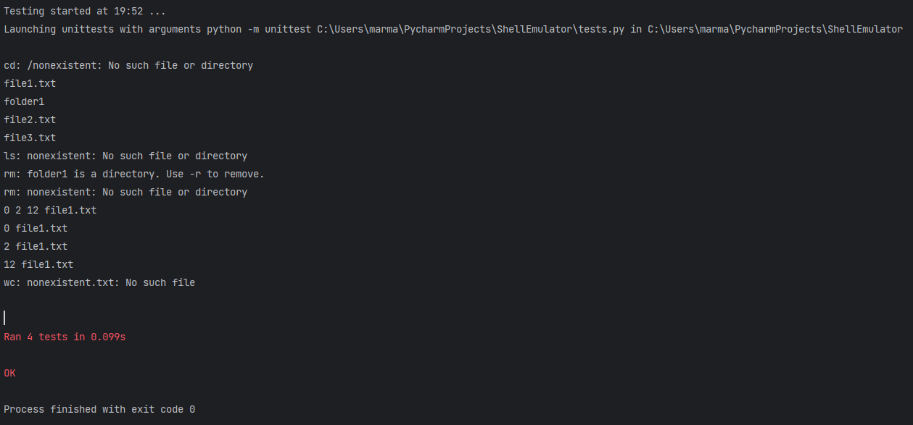

# Эмулятор оболочки виртуальной файловой системы

---

## Общее описание

В данном проекте разработан эмулятор оболочки для работы с виртуальной файловой системой. Эмулятор запускается в режиме командной строки (CLI), поддерживая работу с виртуальной файловой системой, хранящейся в виде ZIP-архива. Конфигурационный файл определяет параметры работы программы, включая имя хоста и путь к архиву.

Эмулятор поддерживает следующие команды:
1. **`cd`** — смена текущей директории.
2. **`ls`** — просмотр содержимого текущей директории.
3. **`rm`** — удаление файла или директории.
4. **`wc`** — подсчёт строк, слов и символов в файле.
5. **`exit`** — завершение работы эмулятора.

---

## Конфигурация

Конфигурационный файл имеет формат CSV и содержит:
- Имя хоста для отображения в командной строке.
- Путь к архиву виртуальной файловой системы.

---

## Описание функций

### Основные методы класса `ShellEmulator`

#### `__init__(self, config_path)`
- **Описание**: Загружает конфигурацию.
- **Функционал**:
  - Инициализирует параметры: имя хоста, текущую директорию, корневую директорию и содержимое архива.

#### `load_config(self, config_path)`
- **Описание**: Загружает настройки из CSV-файла.
- **Функционал**:
  - Возвращает словарь с параметрами: имя хоста и путь к архиву.

#### `load_zip(self)`
- **Описание**: Загружает содержимое ZIP-архива в память.
- **Функционал**:
  - Возвращает словарь, где ключи — пути к файлам и директориям, а значения — метаданные файлов.

#### `execute_command(self, command)`
- **Описание**: Обрабатывает пользовательский ввод.
- **Функционал**:
  - Вызывает соответствующие методы для выполнения команд.

#### `change_directory(self, path)`
- **Описание**: Реализует команду `cd` для смены текущей директории.
- **Функционал**:
  - Поддерживает переход в корень (`/`), на уровень выше (`..`), а также в существующие директории.

#### `list_directory(self, path="")`
- **Описание**: Реализует команду `ls` для отображения содержимого текущей или указанной директории.
- **Функционал**:
  - Возвращает список файлов и папок.

#### `word_count(self, args)`
- **Описание**: Реализует команду `wc` для подсчёта строк, слов и символов в файле.
- **Функционал**:
  - Поддерживает флаги `-l`, `-w`, `-m`.

#### `remove_file_or_directory(self, args)`
- **Описание**: Реализует команду `rm` для удаления файла или директории.
- **Функционал**:
  - Поддерживает рекурсивное удаление с флагом `-r`.

#### `remove_from_zip(self, zip_file_path, items_to_remove)`
- **Описание**: Обновляет архив, удаляя из него указанные файлы и папки.

#### `exit_shell(self)`
- **Описание**: Завершает работу эмулятора.

#### `run(self)`
- **Описание**: Основной цикл работы эмулятора.

---

## Примеры использования

а

## Результаты тестирования

